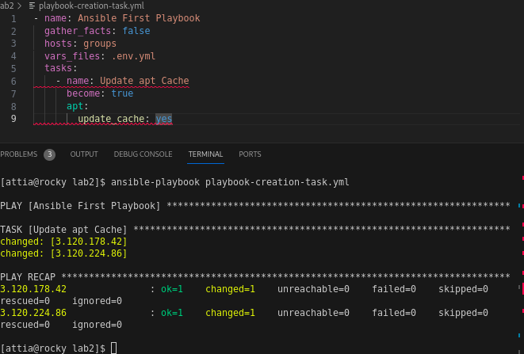
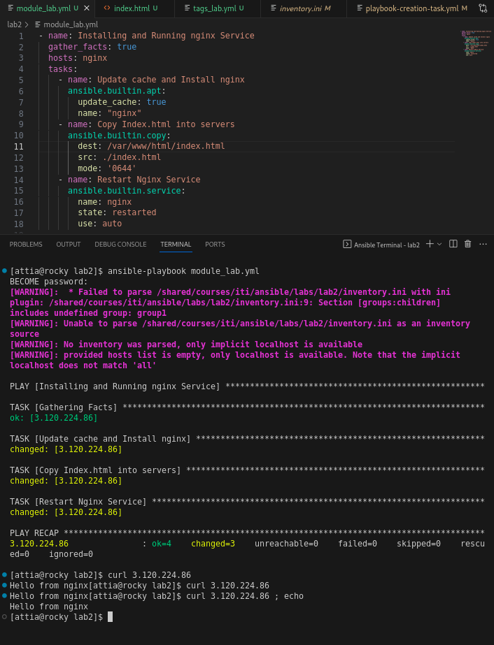
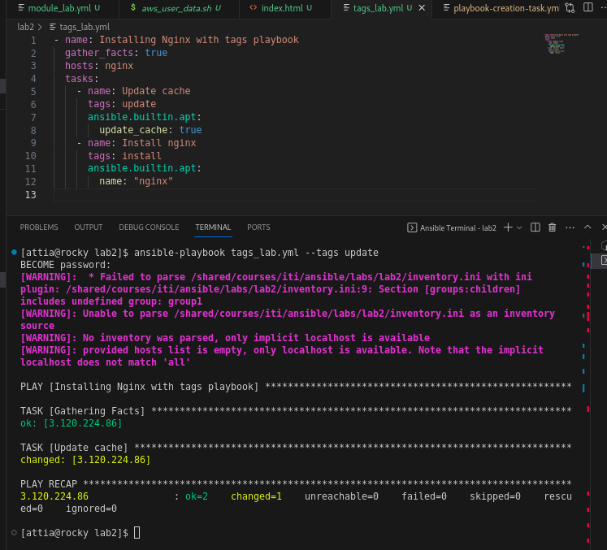
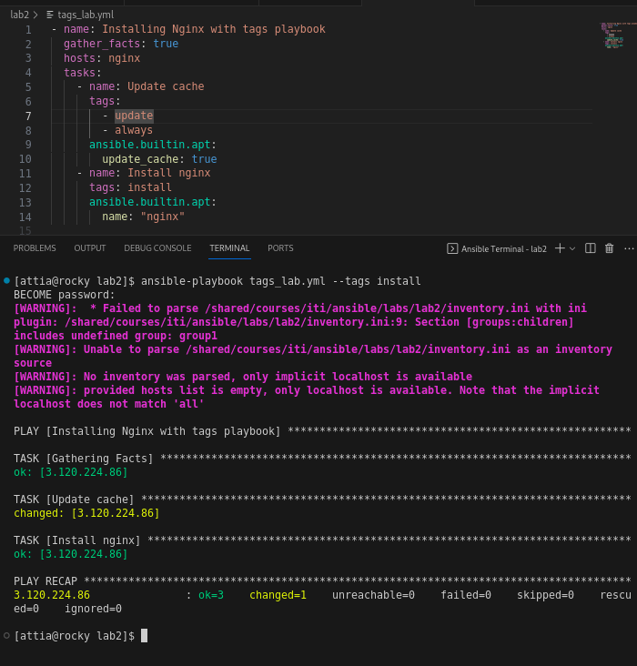
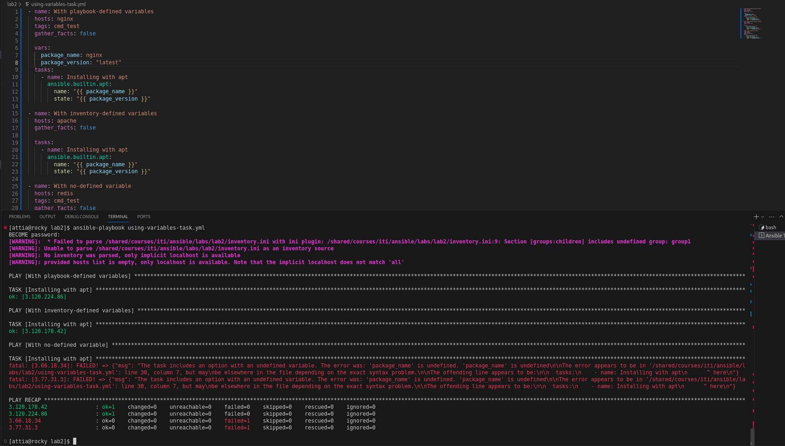
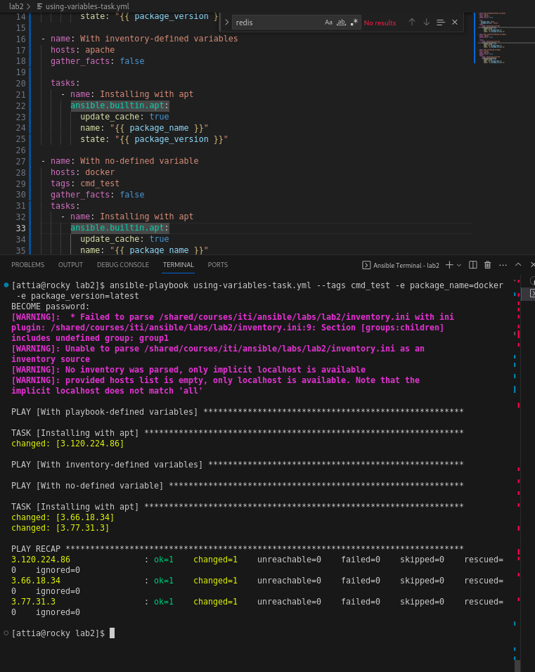

# lab1-ansible-iti

StudentName:  Ahmed Attia Abdelmaksoud mohamed Helal

`aws_user_data.sh`  is a bash script used to initialize EC2 instance though user_data to work as a ansible clients

----------

### Task1: hello Playbooks 

------------

### Task2: Using Modules 

-----------

### Task3 : Using Tags

--------

### Task 4: Using Variables

