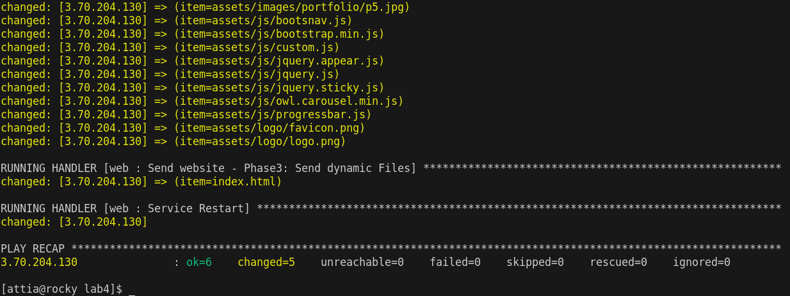

# lab2-ansible-iti

StudentName: Ahmed Attia Abdelmaksoud mohamed Helal

`aws_user_data.sh` is a bash script used to initialize EC2 instance though user_data to work as ansible clients

### `ansible-playbook` command output

-----------

### Verify that the website is working 

that is a sample website

all copyrights are reserved

